<!-- ============================================================
  README de perfil — troque SEU-USUARIO, SEU-LINKEDIN e SEU-EMAIL
  Dica: o repositório precisa ter o MESMO nome do seu usuário
============================================================ -->

<div align="center">




<br/>

<a href="https://github.com/Pedro-D-Marques"></a>
<a href="https://www.linkedin.com/in/pedro-daniel-marques-811996317/"></a>
<a href="mailto:pedrodmarques.dev@gmail.com"></a>


<br/><br/>


</div>


## `> sobre_mim`

Tenho 21 anos, sou de Campinas (SP) e trabalho como **Analista**, na interface entre documentação técnica, equipamentos wireless e laboratórios. Sou formado em **Análise e Desenvolvimento de Sistemas** e hoje estudo **Cybersecurity com foco em Red Team** na FIAP.

Meu dia a dia mistura **análise técnica, redes, ferramentas de teste e automação**, e é por isso que quero construir uma carreira onde segurança, desenvolvimento e infraestrutura se encontram.

```text
foco_atual   = Cybersecurity / Offensive Security / Red Team
base_tecnica = Redes · Linux · Windows · C#/.NET · Python
em_evolucao  = Back-End Java · Cloud Security · DevSecOps
idiomas      = Português (nativo) · Inglês (B2, uso profissional)
```


## `> skills` 

> Dividi por nível de forma transparente: o que uso no trabalho, o que conheço, o que estou aprendendo e o que me interessa.

<table>
<tr>
<td width="50%" valign="top">

### 🟣 Professional
*Uso no trabalho / em projetos reais*


</td>
<td width="50%" valign="top">

### 🧠 Knowledge
*Base sólida, em prática contínua*


</td>
</tr>
<tr>
<td width="50%" valign="top">

### 🔵 Currently Learning
*Em estudo — ainda não é experiência profissional*

-0d1117?style=flat-square&logo=openjdk&logoColor=white&labelColor=0d1117&color=7c6bd6)
-0d1117?style=flat-square&logo=hackthebox&logoColor=white&labelColor=0d1117&color=7c6bd6)


</td>
<td width="50%" valign="top">

### ⚪ Interests
*Quero chegar lá*


</td>
</tr>
</table>


## `> redes_e_infra`

| Área | Tópicos |
|:--|:--|
| **Fundamentos** | TCP/IP · IPv4/IPv6 · DNS · DHCP · portas e protocolos · cliente/servidor |
| **Camada física/enlace** | Ethernet · Wi-Fi |
| **Sistemas** | Linux · Windows · serviços de rede |
| **Diagnóstico** | Troubleshooting · análise de conectividade · análise de tráfego (Wireshark) |
| **Segurança** | Conceitos de segurança de redes e infraestrutura (em estudo na pós-graduação) |


## `> wireless_rf_telecom`

Contato técnico com tecnologias de comunicação sem fio através do trabalho com equipamentos e laboratórios:

<details open>
<summary><b>Ver tecnologias</b></summary>

<br/>

| Tecnologia | Detalhes |
|:--|:--|
| **Wi-Fi** | 802.11 · HT20/HT40 · Wi-Fi 6 / 6E / 7 (802.11be, EHT) · bandas de 2.4, 5 e 6 GHz |
| **Bluetooth** | Bluetooth · BLE · diferentes PHYs (LE 2M) · análise de conectividade |
| **Outras** | NFC (13.56 MHz) · UWB · RFID UHF · NB-IoT · Wireless Power Transfer (Qi) · celular |
| **Conceitos de RF/EMC** | Ensaios radiados e conduzidos · potência de transmissão · canais e largura de banda · modulação · antenas e ganho · modos de teste |

</details>


## `> experiencia`

**Analista** · Associação Versys · *desde jul/2025*

- Análise técnica de documentação e triagem de processos.
- Validação de amostras, conferência de modelos, variantes, acessórios e funcionamento
- Identificação de inconsistências entre documentação, fotos e amostras físicas
- Interface técnica com laboratórios, clientes e fabricantes, em **português e inglês**
- Uso de ferramentas de teste e acesso remoto no suporte aos processos


## `> projetos_e_laboratorios`

| Projeto | Área | Stack | Status |
|:--|:--|:--|:--|
| **Home Lab — Redes & Linux** | Infraestrutura | — | 🔜 A adicionar |
| **Red Team Lab** | Offensive Security | — | 🔜 A adicionar |
| **Cloud / DevSecOps Lab** | Cloud | — | 🔜 A adicionar |

<!-- Para adicionar um projeto, copie uma linha:
| **[Nome](https://github.com/SEU-USUARIO/repo)** | Área | Stack | ✅ Concluído |
-->


## `> github_contributions`

<div align="center">


</div>


## `> formacao`

| Formação | Instituição | Status |
|:--|:--|:--|
| Tecnólogo em Análise e Desenvolvimento de Sistemas | UniMetrocamp Wyden | ✅ Concluído |
| Pós-Graduação em Cibersegurança Ofensiva / Red Team | FIAP | 🔄 Em andamento · previsão jan/2027 |
| Back-End Java | Alura | 🔄 Em andamento |

> Sem certificações externas de mercado por enquanto — elas entram aqui quando eu as conquistar.


## `> objetivo`

Combinar **Cybersecurity + Desenvolvimento + Infraestrutura + Cloud** para atuar em **Offensive Security / Red Team**, com bagagem para entender também o lado de quem constrói (Back-End, DevSecOps) e de quem mantém (redes e infraestrutura).


## `> contato`

<div align="center">

<a href="https://www.linkedin.com/in/pedro-daniel-marques-811996317/"></a>
<a href="https://github.com/Pedro-D-Marques"></a>
<a href="mailto:pedrodmarques.dev@gmail.com"></a>

<br/><br/>

<sub><code>$ echo "learning in public, one lab at a time"</code></sub>


</div>
